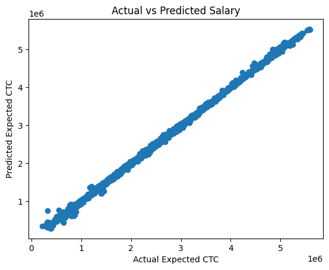

# Salary Prediction using Machine Learning

## Project Overview
This project predicts the expected salary (CTC) of job candidates using Machine Learning.

## Dataset
The dataset contains 25,000 applicant records with features like:
- Experience
- Department
- Role
- Education
- Certifications
- Current CTC

Target variable:
Expected_CTC

## Model Used
Random Forest Regression

## Results
R² Score: 0.9995

## Visualization

## Tools
Python  
Pandas  
Scikit-learn  
Matplotlib  
Google Colab
